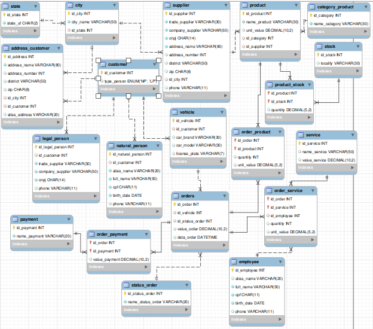

# desafio-centro-automotivo

Desafio do curso de Ciência de Dados - Criando um Banco de Dados para uma Oficina - conteúdo da DIO

## 1 - Criar o modelo relacional para ser utilizado em um centro automotivo.

Utilizado as seguintes entidades:
-Cliente
-Carro
-Peças
-Serviços
-Funcionário
-Ordem de Serviço
-Pagamento

## 2 - Criar o script SQL para criação do esquema de banco de dados

## Resolução do desafio proposto

Criado tabela cliente com os seguintes campos:
- id_customer - id do cliente
- type_person - tipo do cliente (pode ser PJ ou PF)

Criado tabela de endereços, como cada endereço tem cidade e estado que se repetem, foi criado também uma tabela para cada uma destas entidades, linkando através do id
- Tabela Estado
  - id_state: id do estado
  - state_uf: sigla do estado da federação
- Tabela Cidade
  - id_city: id da cidade
  - city_name: nome da cidade
  - id_state: id do estado para linkar com a tabela de estados
- Tabela de endereços
  - id_address: id do endereço
  - address: logradouro
  - number: número da rua
  - district: bairro
  - zip: CEP
  - id_city: id da cidade para linkar com a tabela de cidades
  - id_customer: id do cliente para linkar com a tabela de clientes
  - alias_address: apelido do endereço Ex. casa, trabalho

  Criado tabela pessoa física (natural_person):
- id_natural_person: id da pessoa física
- id_customer: id do cliente linkar com a tabela cliente
- alias_name: apelido do cliente
- full_name: nome completo do cliente
- cpf: único para cada cliente cadastrado
- birth_date: data de nascimento
- phone: número de telefone

Criado tabela pessoa jurídica (legal_person):
- id_legal_person: id da pessoa jurídica
- id_customer: id do cliente linkar com a tabela cliente
- trade: nome fantasia
- company: razão social
- cnpj: único para cada fornecedor cadastrado
- phone: número de telefone

Criado tabela de fornecedores, e utilizando as tabelas de cidade e estado já criada na etapa anterior
- id_supplier: id do fornecedor
- trade: nome fantasia
- company: razão social
- cnpj: único para cada fornecedor cadastrado
- phone: número de telefone
- address: logradouro
- number: número da rua
- district: bairro
- zip: CEP
- id_city: id da cidade para linkar com a tabela de cidades

Criado tabela de categoria de produtos
- id_category: id da categoria de produtos
- name_category: nome da categoria

Criado tabela de produtos
- id_product: id do produto
- name_product: nome do produto
- unit_value: valor unitário do produto
- id_category: id da categoria para linkar com a tabela de categorias de produtos
- id_supplier: id do fornecedor para linkar com a tabela de fornecedores

Criado tabela de pagamentos
- id_payment - id da forma de pagamento
- name_payment - tipo da forma de pagamento

Criado tabela de funcionários
- id_employee: id do funcionário
- alias_name: apelido
- full_name: nome completo
- cpf: único para cada funcionário
- birth_date: data de nascimento
- phone: telefone

Criado tabela de serviços
- id_service: id do serviço
- name_service: nome do serviço
- value_service: valor do serviço

Criado tabela de status da ordem de Serviço
- id_status_order: id do status da OS
- name_status_order: nome do status da OS

Criado tabela de veículos
- id_vehicle: id do veículo
- id_customer: id do cliente
- car_brand: marca do veículo
- car_model: modelo do veículo
- license_plate: placa do veículo

Criado tabela de ordem de serviço
- id_order: id da OS
- id_vehicle: id do veículo linkar com tabela de veículos
- id_status_order: id do status da OS linkar com tabela de status da OS
- value_order: valor total da OS
- date_order: data do pedido

Criado tabela OS x forma de pagamento:
id_order: id da OS
id_payment: id da forma de pagamento
value_payment: valor do pagamento

Criado tabela OS x produto
para que cada OS possa ter mais de um produto
- id_order: id da OS linkar com tabela de OS
- id_product: id do produto linkar com tabela de produtos
- quantity: quantidade de produto
- unit_value: valor unitário do produto

Criado tabela OS x serviço
- id_order: id da OS linkar com tabela de OS
- id_service: id do serviço linkar com tabela de serviços
- id_employee: id do funcionário responsável pelo serviço
- quantity: quantidade de serviço
- unit_value: valor unitário do serviço

Criado tabela estoque
- id_stock: id do estoque
- locality: local do estoque

Criado tabela estoque x produto
- id_stock: id do estoque linkar com a tabela estoque
- id_product: id do produto linkar com a tabela produto
- quantity: quantidade de produto em estoque

## 3 - Persistência de dados para testes

Utilizado arquivo inserts.sql para popular o banco de dados.

## 4 - Recuperação de informações com queries SQL

- relação de fornecedores por ordem alfabética com máscara no CNPJ e Telefone
- relatório de produtos por ordem de fornecedor e quantidade em estoque
- Resumo das vendas de um determinado dia com quantidade de pedidos, valor total dos pedidos, ticket médio, menor valor de pedido e maior valor de pedido
- Quantidade de pedidos por consumidor
- Pedidos com mais de uma forma de pagamento

## Considerações Finais
Foi utilizado o MYSQL Workbench com uma imagem docker mysql para realizar os testes.